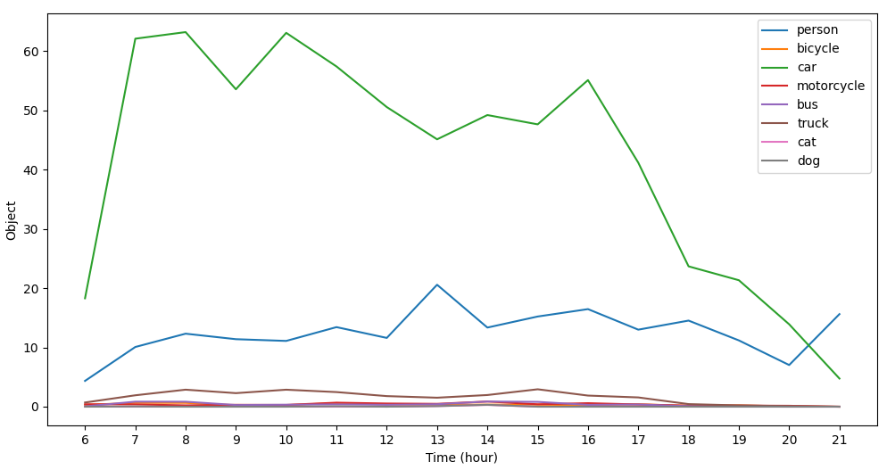

# Traffic Counter Data Engineering Project

This project uses the [YOLOv5](https://github.com/ultralytics/yolov5) object detector and
[SORT](https://github.com/abewley/sort) tracking algorithm to collect traffic data which is stored in an AWS
relational database.

  

    <strong>Figure 1:</strong> Traffic counter tracking in real-time.

## ETL Pipeline

### Extraction:
The object detector outputs bounding boxes and class IDs for each detected object in a frame. We then pass the centroid
of these bounding boxes to our tracking algorithm. The tracker assigns each of these centroids a tracking ID, which
allows us to keep track of each object from frame to frame. When one of the centroids intersects the red line, we
increment a counter for that particular object class. The object detector uses [PyTorch](https://pytorch.org/) which
allows for fast GPU performance, each frame takes about 0.012s to process.

### Transform:
We use a dict to store the counts of each class such as cars, people, trucks and motorcycles. Then on every 15 minutes
we connect to the remote AWS database using pymysql and load the data into a relational database.

### Load:
The relational database is stored in the cloud on an AWS RDS database with a MySQL engine. The table has an ID partition
key column, along with a timestamp and column for the number counted for each object class we are interested in.

## Analysis
Figure below shows the average number of objects detected over a period of 10 days per hour.

  

    <strong>Figure 2:</strong> Average number of objects tracked in one week.

